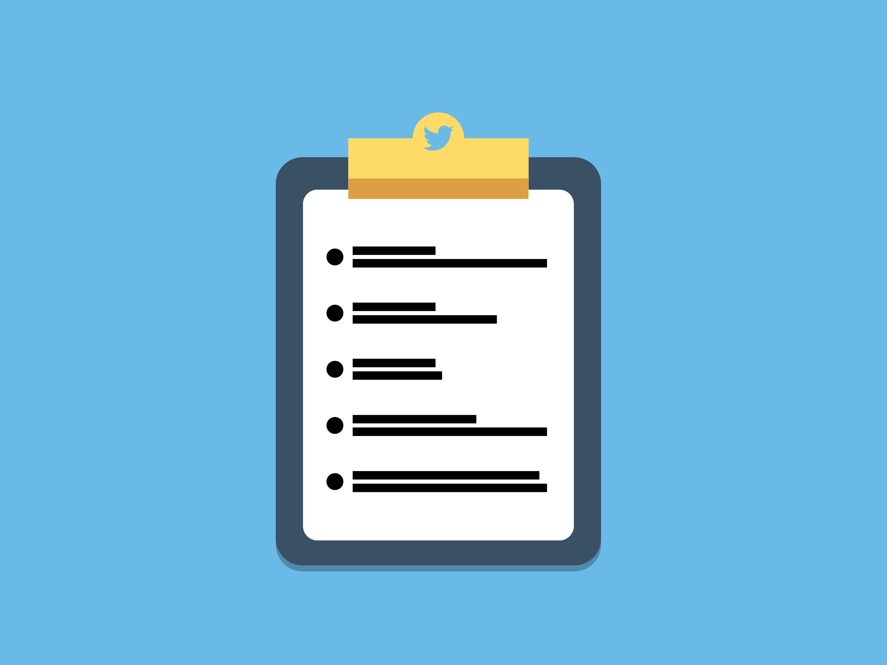
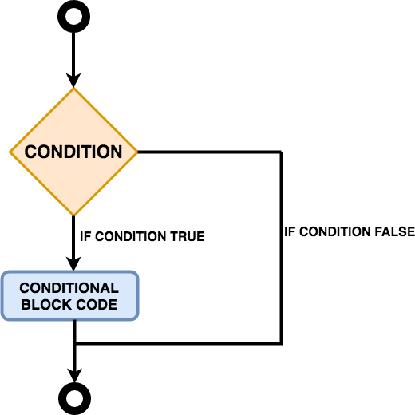

# Read: 03 - HTML Lists, CSS Boxes, JS Control Flow

*Today we will took a brief about some* `HTML` *Topics*

## HTML Topics

* Lists
* Boxes

*also we will back to pre Read-02 To Cover Some Remaining items*

## JS Topics

* Basic JavaScript Instructions
* Decisions and Loops

## Let's Start

> HTML

**Lists**

- Numbered lists 

 

*HTML allow Us To Creat an OrderList By It's Tags* `<ol>` *With Using Items Tags insid List Tag* `<li>`

**For Example**

```
<ol>
  <li>Coffee</li>
  <li>Tea</li>
  <li>Milk</li>
</ol> 

```
The Out Put Will be :

```
1.Coffee
2.Tea
3.Milk

```


- Unordered lists

 

*HTML Also Provide us with Unorder List* `<ul>` *With Using Items Tags insid List Tag* `<li>`

**For Example**

```
<ul>
  <li>Coffee</li>
  <li>Tea</li>
  <li>Milk</li>
</ul>   

```
The Out Put Will be :

```
Coffee
Tea
Milk

```

- Definition lists

*Its used with Terms and thier Definition or Terms and Name , The Tag that Define Definition List is* `<dl>` 

*Insid the* `<dl>` *we will put the terms and thier descrption , for this we use the tag* `<dt>` *for terms and*  `<dd>` *for terms descrptions*

**For Example**

```
<p>These three elements are used to create a description list:</p>

<dl>
  <dt>Coffee</dt>
  <dd>Black hot drink</dd>
  <dt>Milk</dt>
  <dd>White cold drink</dd>
</dl>

```
The Out Put Will be :

```
These three elements are used to create a description list:

Coffee
Black hot drink
Milk
White cold drink

```

For More Example : [w3schools](https://www.w3schools.com/html/html_lists.asp)


**Boxes**

*Every HTML element has own space and its like a box that content this element*
*due of that we can apply a style using css on that box like changing width or add bolder ...ect*

- using `width`  and `hieght` Tags  we can determine the box dimension 

**For Example**

```
<p>These three elements are used to create a description list:</p>

<div>
    <p>
       Hello EverBody in Read-02
    </p>
</div>


div.box {
height: 500px;
width: 500px;
background-color: #8E24AA;}
p {
height: 75%;
width: 75%;
background-color:#8E24AA;}

```

- Overflowing Content

*the job of that tags is tell broswer about extra content in specific box limition , ex: if i have a large content in small box*
*it will be overflow of not display in broswer,so we have some tags that control this extra content* 
*we have a tag called hidden* `<hidden>` *and the* `scroll` .
*the first tags it hidden the extra content and the second one it adds a scrollbar to see all content*

For Example You Can Go to This Site [Overflowing-w3schools](https://www.w3schools.com/cssref/tryit.asp?filename=trycss_overflow)

> JS

**Basic JavaScript Instructions**

- Arrays

*An array is a data structure where we can store more than one value*

 

```
var Car;
Car ['BMW', 'Audi', ' Toyota']; 

```


**VALUES IN ARRAYS**

*Values In Array Access By Index* 

```

INDEX    VALUE
0       'BMW '
1       'Audi'
2       'Toyota'

```

**Decisions and Loops**

- If Statment 

*if statement is conditional statement that, if it true, then performs it run the block code.  if , not its skip it.*
*In Loops, it always checks the condition statement as an entry or stoping loops*

 

**For Example**

```
if (hour < 18) {
  greeting = "Good day";
}

```

- Switch Loop

*a switch statement is a type of condition control  used to allow the value of a variable to change the control of program*

 


**For Example**

```

var day;
switch (new Date().getDay()) {
  case 0:
    day = "Sunday";
    break;
  case 1:
    day = "Monday";
    break;
  case 2:
    day = "Tuesday";
    break;
  case 3:
    day = "Wednesday";
    break;
  case 4:
    day = "Thursday";
    break;
  case 5:
    day = "Friday";
    break;
  case  6:
    day = "Saturday";
}
document.getElementById("demo").innerHTML = "Today is " + day;
</script>

```

- Loops

*Loop it check the condition* `samilier to If Condition` *and if it true it will be run the code* `samilir to function`

**Loops Types**
- For 
- While
- Do While

**and you can see the Differnce in the image**

 

> Loop Component 

- For Keyword 
- Condition
- Curly Bracket 

 

**Loop Example**
```
var text = "";
var i;
for (i = 0; i < 5; i++) {
  text += "The number is " + i + "<br>";
}
document.getElementById("demo").innerHTML = text;

```

## Contact Info : 
**Please Feel Free To Contact Me When You Need help ^_^**
* [www.facebook.com/aghyadalbalkhi](www.facebook.com/aghyadalbalkhi)
* Email : aghyadalbalkhi@gmail.com


