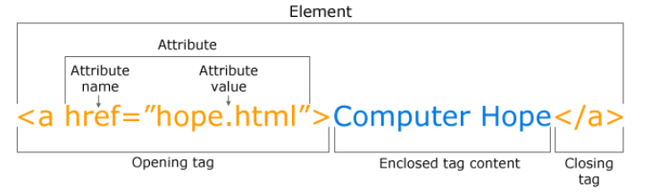
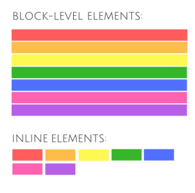
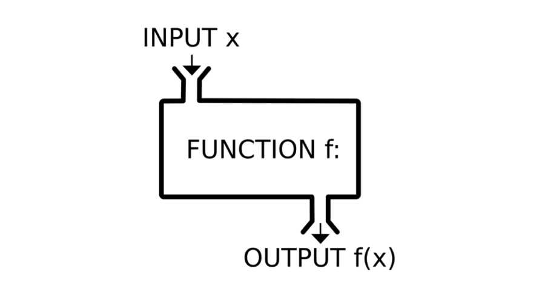

# Read: 04 - HTML Links, CSS Layout, JS Functions

*Today Topic will be a about*
- Links
- Layout
- Functions , Methods
- Objects

## HTML Topics

> Links 

*The* `<a>` *tag defines a hyperlink, which is used to link from one page to another.*
*The most important* `attribute` *of the* `<a>` *element is the* `href` *attribute, which indicates the link's destination.*

 

*we have several Type Of Links as showen Below*

**Creating links between pages**


*Uesd the* `<a>` *to Link The Internal Pages Togather Of The Same WebSite(Pages That are inside the site)we called* `relative links`

 

**For Example**

```
<!DOCTYPE html>
<html>
<body>
<h2>Relative URLs</h2>
<p><a href="html_images.asp">HTML Images</a></p>
<p><a href="/css/default.asp">CSS Tutorial</a></p>

</body>
</html>

```
To Run into The Live Example Click Here [w3schools](https://www.w3schools.com/html/tryit.asp?filename=tryhtml_links)


**Linking to other sites**


 

*Uesd the* `<a>` *to Link The Other website Pages and we called* `absolute links`

**For Example**

```
<!DOCTYPE html>
<html>
<body>

<h2>Absolute URLs</h2>
<p><a href="https://www.w3.org/">W3C</a></p>
<p><a href="https://www.google.com/">Google</a></p>

</body>
</html>

```
To Run into The Live Example Click Here [w3schools](https://www.w3schools.com/html/tryit.asp?filename=tryhtml_links)

**Email links**

 

*Uesd the* `<a>` *To Luanch the email program On Client Side and addresses an email to a specified email address By using* `mailto` *as the value to* `href` *attribute*


**For Example**

```
<!DOCTYPE html>
<html>
<body>

<a href="mailto:jon@example.org">Email Jon</a>

</body>
</html>

```

> Layout

**Controlling the position of elements**

 

*In HTML we have Elements That has it's Own Flow and we can classifying into* `Block Elements` *and `Inline Elements`

* Block Tags

Block elements are the elements that always start with a new line, take up all available width of the website and are displayed in a column

- `<h1>`
- `<p>`
- `<ul>`

* Inline Tags

- ``
- `<b>`
- `<i>`

* Controlling the Position of Elements

 

- Normal Flow : static
- Relative Positioning
- Absolute positioning
- Fixed Positioning 

**Designing for different sized screens** `Responsive Design`


 

*User have diffrenet devies and these deviese have multi screen size , so we need to be fit with the screen size that user has and deal with it with css*

Am I Responsive ? Click Here To Check [Responsive](http://ami.responsivedesign.is/)

**Layout Grids**

 

*CSS Grid Layout used to Desing layout system with CSS. it can deal with columns and rows and create a layout page. we can work with Grid Layout by applying CSS rules*

Need Into Info ? Click Here To Go [Css Grid](https://css-tricks.com/snippets/css/complete-guide-grid/)


## JavaScript Topics

> Funcation

 

*It's a group of series of statements togather to do a specifics taks*

**Function  Elements**
- function  Name
- Parameter
- Header
- Code insid Function  

**Declaring A Function**

```
function name(parameter) {
   [statements]
}

```
- `name` The Name of Function
- `parameter` The Variable Passed To The Function
- `statements` The statements which comprise the body of the function

**Lest's Have a Example**

```
function myFunction(p1, p2) {
  return p1 * p2;
}
document.getElementById("demo").innerHTML = myFunction(4, 3);
```


## Contact Info : 
**Please Feel Free To Contact Me When You Need help ^_^**
* [www.facebook.com/aghyadalbalkhi](www.facebook.com/aghyadalbalkhi)
* Email : aghyadalbalkhi@gmail.com
