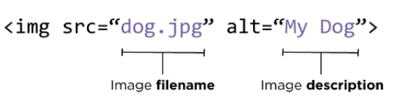
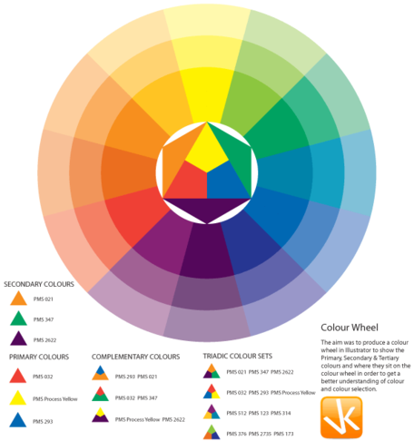

# Read: 05 - HTML Images; CSS Color & Text

*Here What We will Cover In Read-05*
- Images
- Color
- Text

## Let's Start

> Images

 

* **Adding Images**

*The* `` *tag used to add images to html web page by using it's tag with* `src` *attribute To set The resource of the image*

 

**For Example**

```
<!DOCTYPE html>
<html>
<body>

<h2>HTML Image</h2>


</body>
</html>

```

* **Image attribute**

*every tag in* `HTML` *has attribute and img also has like* `src` `alt` `width` *The attribute src stands for source and tells the name of the image, and the attribute alt describes the image and Width* 

**For Example**

```
<!DOCTYPE html>
<html>
<body>

<h2>HTML Image</h2>


</body>
</html>

```

* **Where to Place Imagesin Your Code**

*we will see some cases of input the image insid* `<p>`

- before paragraph `The paragraph starts on a newline after the image`
- after paragraph `The paragraph starts on a newline after the image`
- insid paragraph `The paragraph starts on a newline after the image`

**For Example**

```


<p>There are around 10,000 living species of birds
 that inhabit different ecosystems from the
 Arctic to the Antarctic. Many species undertake
 long distance annual migrations, and many more
 perform shorter irregular journeys.</p>

<hr />

<p>  There are around 10,000 living
 species of birds that inhabit different
 ecosystems from the Arctic to the Antarctic. Many
 species undertake long distance annual
 migrations, and many more perform shorter
 irregular journeys. </p>

<hr />

<p> There are around 10,000 living species of birds
 that inhabit different ecosystems from the
 Arctic to the Antarctic.  Many species undertake long
 distance annual migrations, and many more perform
 shorter irregular journeys.
 
 </p>

```

*  **Aligning Images**

*These attributes to  indicate how the other parts of a page should flow around image*

- left `float :left`
- Right paragraph `float:Right`

**For Example**

```
<!DOCTYPE html>
<html>
<head>
<style>
img {
  float: right;
}
</style>
</head>
<body>

<p>In this example, the image will float to the right in the paragraph, and the text in the paragraph will wrap around the image.</p>

<p>
Lorem ipsum dolor sit amet, consectetur adipiscing elit. Phasellus imperdiet, nulla et dictum interdum, nisi lorem egestas odio, vitae scelerisque enim ligula venenatis dolor.  velit.</p>

</body>
</html>

```

To Run into The Live Example Click Here [w3schools](https://www.w3schools.com/css/css_float.asp)

* **Three Rules for Creating Images**
- Check The Right Format Of Images
- Determie The Right Size Of Images
- Use a Good resolution

> Color

* **How to specify colors**
 

*we can specify the color in Css In Three Way*

- rgb values `h1 {color: DarkCyan;}`
-  hex codes `h2 {color: #ee3e80;}`
- color name `p {color: rgb(100,100,90);;}`

```
<!DOCTYPE html>
<html>
<body>

<h1 style="background-color:DodgerBlue;">Hello World</h1>

<p style="background-color:Tomato;">
Lorem ipsum dolor sit amet, consectetuer adipiscing elit, sed diam nonummy nibh euismod tincidunt ut laoreet dolore magna aliquam erat volutpat.
</p>

</body>
</html>

```
To Run into The Live Example Click Here [w3schools](https://www.w3schools.com/html/html_colors.asp)


* **Color terminology and contrast**


* **Background color**
