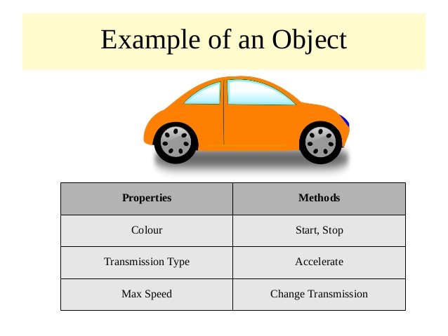

# Read: 06 - JS Object Literals; The DOM

*Today we will took a brief about* `Object Literals` *and* `Document Object Model [DOM]`

## JS Topics

* Object Literals
* Document Object Model `[DOM]`

## Let's Start

> Object Literals

**Create An Object In JS**

`Object` *is an abstract data type where it can hold properties or method and in sometimes other Objects*


 

**Create Object In JS**

```
var person = {
  firstName : "John",
  lastName  : "Doe",
  age     : 50,
  eyeColor  : "blue"
};

```
For More Example : [w3schools](https://www.w3schools.com/js/js_object_definition.asp)

**Accessing Object In JS**

 

*To Access The Properties or method in Objects we use Dot* `.` *and we can also use square brackets to access proprties*

**For Example**
```
var person = {
  firstname:"John",
  lastname:"Doe",
  age:50,
  eyecolor:"blue"
};

document.getElementById("demo").innerHTML = person["firstname"] + " is " + person["age"] + " years old.";
```
> Document Object Model 

**What is DOM**

 

*The Document Object Model (DOM) is the data representation of the objects that comprise the structure and content of a document on the web.*
*DOM Tree is a Model Of WebPage*

**Working with DOM Tree**

 

*TO Access and Update An Element In DOM Tree You Need*

- Determine the Node that Represent the Element 
- Use it's text Content and attributes

**For Example**

```
<!DOCTYPE html>
<html>
<body>

<h2>My First Page</h2>

<p id="demo"></p>

<script>
document.getElementById("demo").innerHTML = "Hello World!";
</script>

</body>
</html>
```

For More Example : [w3schools](https://www.w3schools.com/js/js_htmldom_methods.asp)

**JavaScript HTML DOM Node Lists**

*A NodeList object is a list (collection) of nodes extracted from a document.*

**For Example**

```
<!DOCTYPE html>
<html>
<body>

<h2>JavaScript HTML DOM!</h2>

<p>Hello World!</p>

<p>Hello Norway!</p>

<p>Click the button to change the color of all p elements.</p>

<button onclick="myFunction()">Try it</button>

<script>
function myFunction() {
  var myNodelist = document.querySelectorAll("p");
  var i;
  for (i = 0; i < myNodelist.length; i++) {
    myNodelist[i].style.color = "red";
  }
}
</script>

</body>
</html>
```

For More Example : [w3schools](https://www.w3schools.com/js/js_htmldom_nodelist.asp)


## Contact Info : 
**Please Feel Free To Contact Me When You Need help ^_^**
* [www.facebook.com/aghyadalbalkhi](www.facebook.com/aghyadalbalkhi)
* Email : aghyadalbalkhi@gmail.com
