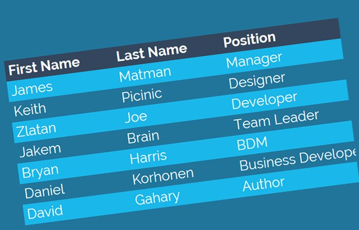

# Read: 07 - HTML Tables; JS Constructor Functions

*Today we will took a brief about some* `HTML` *Topics and some* `JavaScript` *Topics*

## HTML Topics

* Tables


## JS Topics

* Functions, Methods, and Objects

## Let's Start

> HTML

**Tables**

 


*A table represents information in a grid format.*

* Basic Table Structure

```
<table>
    <tr>
        <td>15</td>
        <td>15</td>
        <td>30</td>
    </tr>
    <tr>
        <td>45</td>
        <td>60</td>
        <td>45</td>
    </tr>
    <tr>
        <td>60</td>
        <td>90</td>
        <td>90</td>
    </tr>
</table>
```

- `<table>` used to create a table
- `<tr>` used To Create a Row
- `<td>` used To represent a Cell
- `<th>` used To  represent the heading


* Spanning ColumnS
*we used* `colspan` *attribute* to span a columns

```
<tr>
 <th>Monday</th>
 <td colspan="2">Geography</td>
 <td>Math</td>
 <td>Art</td>
 </tr>
```

* Spanning Rows
*we used* `rowspan` *attribute* to span a Rows

```
<tr>
 <th>6pm - 7pm</th>
 <td rowspan="2">Movie</td>
 <td>Comedy</td>
 <td>News</td>
 </tr>

```
For More Example : [w3schools](https://www.w3schools.com/html/html_tables.asp)


> JavaScript

**Constructors In JavaScript**

 


*It's a way To Create an Objects with a Initial value*

```
// Constructor function for Person objects
function Person(first, last, age, eye) {
  this.firstName = first;
  this.lastName = last;
  this.age = age;
  this.eyeColor = eye;
}

// Create two Person objects
var myFather = new Person("John", "Doe", 50, "blue");
var myMother = new Person("Sally", "Rally", 48, "green");

```


## Contact Info : 
**Please Feel Free To Contact Me When You Need help ^_^**
* [www.facebook.com/aghyadalbalkhi](www.facebook.com/aghyadalbalkhi)
* Email : aghyadalbalkhi@gmail.com


