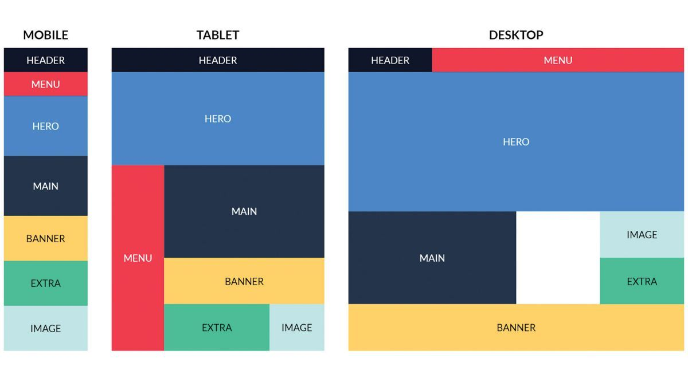

# Read: 08 - More CSS Layout

*Today Topic will be a about*
- Controlling the position of elements
- Layout
- Designing for different sized screens

## CSS Topics

> Controlling the position of elements

 

*In HTML we have Elements That has it's Own Flow and we can classifying into* `Block Elements` *and `Inline Elements`

* Block Tags

Block elements are the elements that always start with a new line, take up all available width of the website and are displayed in a column

- `<h1>`
- `
`
- `<ul>`

* Inline Tags

- ``
- `<b>`
- `<i>`

* Controlling the Position of Elements

 

- Normal Flow : static
- Relative Positioning
- Absolute positioning
- Fixed Positioning 

> Designing for different sized screens `Responsive Design`

 

*User have diffrenet devies and these deviese have multi screen size , so we need to be fit with the screen size that user has and deal with it with css*

Am I Responsive ? Click Here To Check [Responsive](http://ami.responsivedesign.is/)

> Layout Grids 

 

*CSS Grid Layout used to Desing layout system with CSS. it can deal with columns and rows and create a layout page. we can work with Grid Layout by applying CSS rules*

Need Into Info ? Click Here To Go [Css Grid](https://css-tricks.com/snippets/css/complete-guide-grid/)

## Contact Info : 
**Please Feel Free To Contact Me When You Need help ^_^**
* [www.facebook.com/aghyadalbalkhi](www.facebook.com/aghyadalbalkhi)
* Email : aghyadalbalkhi@gmail.com

