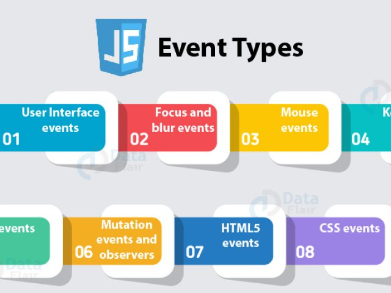

# Read: 09 - Forms and Events

*Today Topic will be a about*
- Forms
- Events

## Let's Start

> Forms 

 

*You can use forms in order to collect data from user.One common example of forms is the SignUp Page. There is more than one type in which data is collected so form controls can be:*

- Adding text `Text input` `Password  input` `Text area`
- Making choices `Radio buttons` `Checkboxes` `Drop-down boxes` 
- Submitting forms `submit data to a server or another page`
- Uploading files `File upload allows users to upload files (e.g. images) to a website`


**How to create forms?**

*unsing the* `<form>` *tags with methods and attributes. Each form will have an action attribute that* *has the link of the page in the server that is going to receive the submitted input.*

*The method attributes for the form can be* `get` *or* `post`
*The <input> tag is used to give more information about the form.*

**Form Controls**
*we can make some validation input on client side*

- Name Validtion so The user can insert the text
- Email Validation so The User Can insert an email only 
- age Validation so the user can insert a Number only

**For Example**

```
<!DOCTYPE html>
<html>
<body>

<h2>HTML Forms</h2>

<form action="/action_page.php">
  <label for="fname">First name:</label><br>
  <input type="text" id="fname" name="fname" value="John"><br>
  <label for="lname">Last name:</label><br>
  <input type="text" id="lname" name="lname" value="Doe"><br><br>
  <input type="submit" value="Submit">
</form> 

<p>If you click the "Submit" button, the form-data will be sent to a page called "/action_page.php".</p>

</body>
</html>
```

For Example You Can Go to This Site [html_forms](https://www.w3schools.com/html/html_forms.asp)


> Lists and Tables

 

*Lists can have many styles, you can have radio buttons or circles or numbers using the selector*`list-style-typ`

*You can also have images for the bullets by linking the image in the* `ul` *tag.*

**Here are some properties that you can aplly to your table:**

`list-style` *property allows you to write all of the different values in any order to apply to the list.*
`width` *to set the width of the table.*

`padding` *to set the space between the border of each table cell and its content.*

`text-transform` *to convert the content of the table headers to uppercase letter-spacing.*

`font-size` *to add additional styling to the content of the table headers.*

`border-top` *border-bottom to set borders above and below the table headers.*

`text-align` *to align the writing to the left of some table cells and to the right of the others.*

`background-color` *to change the background color of the alternating table rows.*

`:hover` *to highlight a table row when a user's mouse goes over it.

> Events in JS

 

**What is The Event**

*events are "things" that happen to HTML elements by JS.*

*event can be something the browser does, or something a user does.*

**some examples of HTML events**

* web page has finished loading
* input field was changed
* button was clicked

**For Example**

```

<!DOCTYPE html>
<html>
<body>

<button onclick="this.innerHTML=Date()">The time is?</button>

</body>
</html>

```


## Contact Info : 
**Please Feel Free To Contact Me When You Need help ^_^**
* [www.facebook.com/aghyadalbalkhi](www.facebook.com/aghyadalbalkhi)
* Email : aghyadalbalkhi@gmail.com
