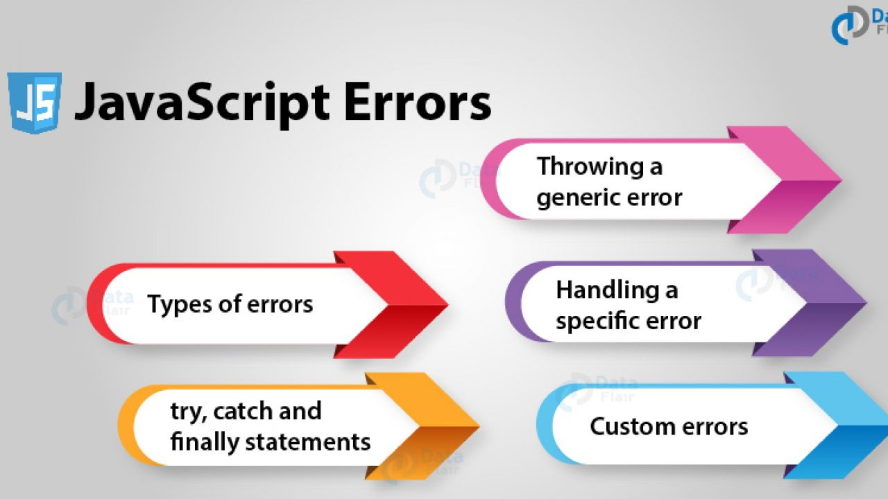
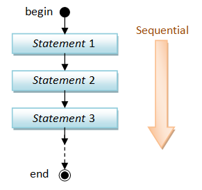
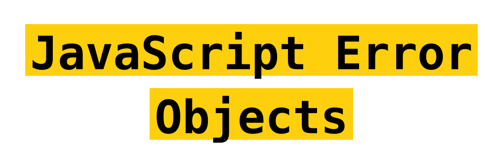
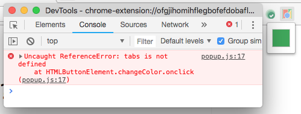
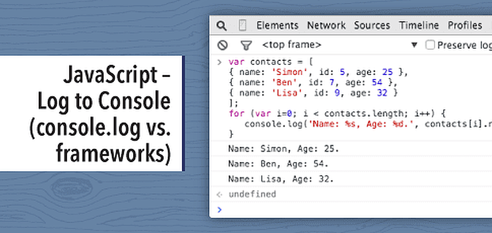

# Read: 10 - JS Debugging

 


*Today Topic will be a about* `JS Handling Error & Debugging`

*In the Artical we will learn about*
- THE CONSOLE & DEV TOOLS 
- COMMON PROBLEMS 
- HANDLING ERRORS 

## JS Topics

> ORDER OF EXECUTION 

 

*To find  an error, we need to know how scripts are processed.
The order in which statements are executed can be complex; some tasks
cannot complete until another statement or function has been run:*

> The Stack 
*JS processes one line code at the time*
*when a statement needs data from another function , it stacks the new function om top of the current task*

> Scope

  

 *Understanding scope will make your code stand out, reduce errors and help you make powerful design patterns with*

 **What is The Scope**
 *Scope is the accessibility of variables, functions, and objects in some particular part of your code during runtime. In other words, scope determines the visibility of variables and other resources in areas of your code*

 **Type of Scope in js**
 *JavaScript language there are two types of scopes*

 * `Global Scope`
 * `Local Scope`

 *Variables defined inside a function are in local scope while variables defined outside of a function are in the global scope. Each function when invoked creates a new scope*

 **For Example - global -**
 ```
 // the scope is by default global

var name = 'Hammad';

console.log(name); // logs 'Hammad'

function logName() {
    console.log(name); // 'name' is accessible here and everywhere else
}

logName(); // logs 'Hammad'

 ```

 **For Example - Local -**

```
function someFunction() {
    // Local Scope #1
    function someOtherFunction() {
        // Local Scope #2
    }
}
```
> UNDERSTANDING ERRORS

*If a JavaScript statement generates an error, then it throws an exception.*
*At that point, the interpreter stops and looks for exception-handl ing code.*

> ERROR OBJECTS 
 

*Error objects can help you find where your mistakes are and browsers have tools to help you read them.*

*Error objects are thrown when runtime errors occur. The Error object can also be used as a base object for user-defined exceptions. See below for standard built-in error types.*

For More Info : [developer mozilla](https://developer.mozilla.org/en-US/docs/Web/JavaScript/Reference/Global_Objects/Error)

> HOW TO DEAL WITH ERRORS

*there are two things you can do with the errors.*

- DEBUG THE SCRIPT TO FIX ERRORS
- HANDLE ERRORS GRACEFULLY 

> A DEBUGGING WORKFLOW 

*Debugging is about deduction: eliminating potential causes of an error*

**BROWSER DEV TOOLS & JAVASCRIPT CONSOLE**
*The JavaScript console will tell you when there is a problem with a script,where to look for the problem, and what kind of issue it seems to be*

**HOW TO LOOK AT ERRORS IN CHROME**

 
*The console will show you when there is an error in your JavaScript*

*In Chrome, navigate to Tools > Advanced > Error Console. The error console will open. Select JavaScript and Errors from the two drop downs. To find the error location, expand one of the errors.*

**WRITING FROM THE SCRIPT TO THE CONSOLE**

*Browsers that have a console have a console object, which has several methods that your script can use to display data in the console.*
*The object is documented in the Console API*

**LOGGING DATA TO THE CONSOLE**

 

*Using*`console.log ()`*method.* 

```
var myObj = { firsname : "John", lastname : "Doe" };
console.log(myObj);

```


## Contact Info : 
**Please Feel Free To Contact Me When You Need help ^_^**
* [www.facebook.com/aghyadalbalkhi](www.facebook.com/aghyadalbalkhi)
* Email : aghyadalbalkhi@gmail.com

