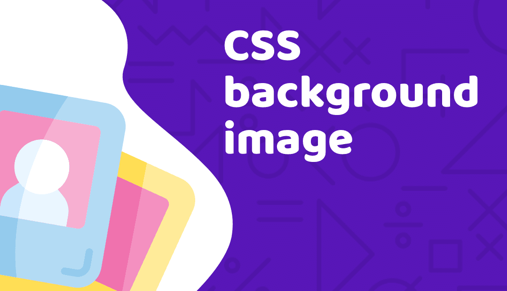
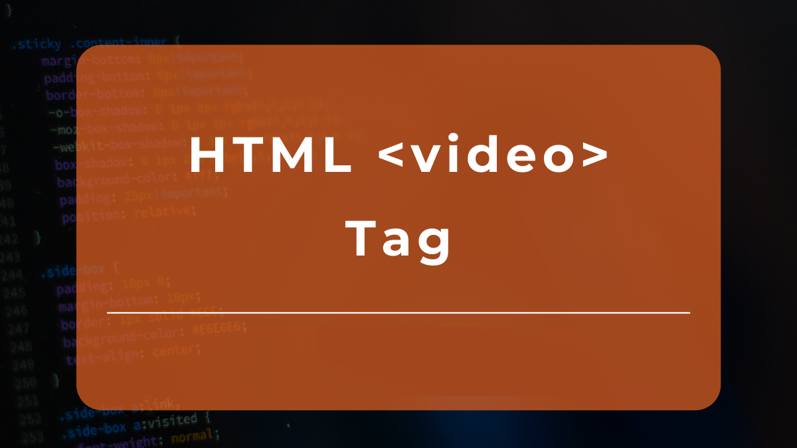

# Read: 11 - Assorted Topics

*Today we will took a brief about some Topics*

- Images
- Practical Information

## Images

* Controlling size of images in CSS
* Aligning images in CSS
* Adding background images

> Images
 
* Controlling size of images in CSS

 

*To Control The  Size Of Image We can Use The  Width and The  Height properties in css*

**For Example**

```
<!DOCTYPE html>
<html>
<body>

<h1>The img width attribute</h1>


</body>
</html>

```

* Aligning images in CSS

*These attributes to  indicate how the other parts of a page should flow around image*

- left `float :left`
- Right paragraph `float:Right`

**For Example**

```
<!DOCTYPE html>
<html>
<head>
<style>
img {
  float: right;
}
</style>
</head>
<body>

<p>In this example, the image will float to the right in the paragraph, and the text in the paragraph will wrap around the image.</p>

<p>
Lorem ipsum dolor sit amet, consectetur adipiscing elit. Phasellus imperdiet, nulla et dictum interdum, nisi lorem egestas odio, vitae scelerisque enim ligula venenatis dolor.  velit.</p>

</body>
</html>

```

To Run into The Live Example Click Here [w3schools](https://www.w3schools.com/css/css_float.asp)

* Adding background images



*The* `background-image` *property allows to place an image behind any HTML element*

```
body {
background-image: url("images/pattern.gif");}

```

*We Can Use some property with background image like* `background-repeat`

```
body {
background-image: url("images/header.gif");
background-repeat: repeat-x;}

```

*also we have other property called* `background-position` that have many values like `left top` `left center` `center top`

```
body {
background-image: url("images/tulip.gif");
background-repeat: no-repeat;
background-position: center top;}

```

> Images

* Search engine optimization


*SEO Stands for Search Engine Optimization which is a component of Search Engine Marketing, Search Engine Optimization is essentially the practice of increasing the quality and quantity of visitors to a website through the Organic Search Results.*

* Using analytics to understand visitors


*By analyzing The User behavior using some tools like Google Analytics*
*Google Analytics gives you the free tools you need to analyze data for your business in one place, so you can make smarter decisions.*

For More Info : [GoogleAnalytics](https://analytics.google.com/analytics/web/provision/#/provision)


> Video



*Before HTML5, a video could only be played in a browser with a plug-in (like flash).*
*The HTML5* `<video>` *element specifies a standard way to embed a video in a web page.*

```
<video src="SDGs.mp4" width="320" height="240" controls>  Text only be displayed in browsers that do not support the video element    </video>

```

> Audio


*Before HTML5, a Audio could only be played in a browser with a plug-in (like flash).*
*The HTML5* `<Audio>` *element specifies a standard way to embed a Audio in a web page.*

```
<audio src="Love In Damascus.mp3" or “ link“ controls>  Text only be displayed in browsers that do not support the audio element    </audio>

```


## Contact Info : 
**Please Feel Free To Contact Me When You Need help ^_^**
* [www.facebook.com/aghyadalbalkhi](www.facebook.com/aghyadalbalkhi)
* Email : aghyadalbalkhi@gmail.com
