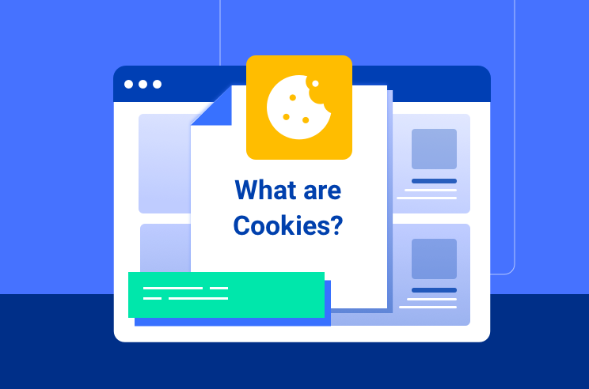

# Read: 13 - Local Storage

*Today we will took a brief about some* `Storage`

* Definition
* Cookies
* HTML5 Storage

> Definition

 

*typically OS provides an abstraction layer for storing and retrieving application-specific data like preferences or runtime state. These values may be stored in the* `registry` `INI files` `XML files` *or some other place according to platform convention*

> Cookies

 

*were invented early in the web’s history, and indeed they can be used for persistent local storage of small amounts of data. But there are three potentially dealbreaking downsides:*

- included with every HTTP request, thereby slowing down our web application by needlessly transmitting the same data over and over

- limited to 4KB of data — enough to slow down our application, but not enough to be terribly useful So, you need to a lot of storage space on the client that persists beyond a page refresh and isn’t transmitted to the server

> HTML5 Storage

 

*is a specification named Web Storage, which was at one time part of the HTML5 specification proper, but was split out into its own specification. Certain browser vendors also refer to it as “Local Storage” or “DOM Storage.” The naming situation is made even more complicated by some related, similarly-named, emerging standards, also it’s a way for web pages to store named key/value pairs locally, within the client web browser. Like cookies, this data persists even after you navigate away from the web site, close your browser tab, exit your browser, or what have you. Unlike cookies, this data is never transmitted to the remote web server (unless you go out of your way to send it manually). Unlike all previous attempts at providing persistent local storage, it is implemented natively in web browsers, so it is available even when third-party browser plugins are not*

## Contact Info : 
**Please Feel Free To Contact Me When You Need help ^_^**
* [www.facebook.com/aghyadalbalkhi](www.facebook.com/aghyadalbalkhi)
* Email : aghyadalbalkhi@gmail.com

