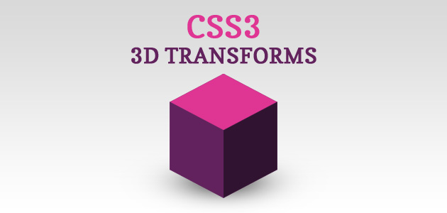
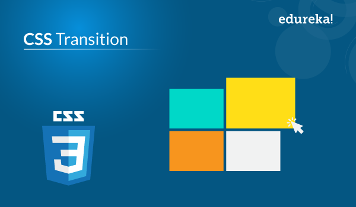
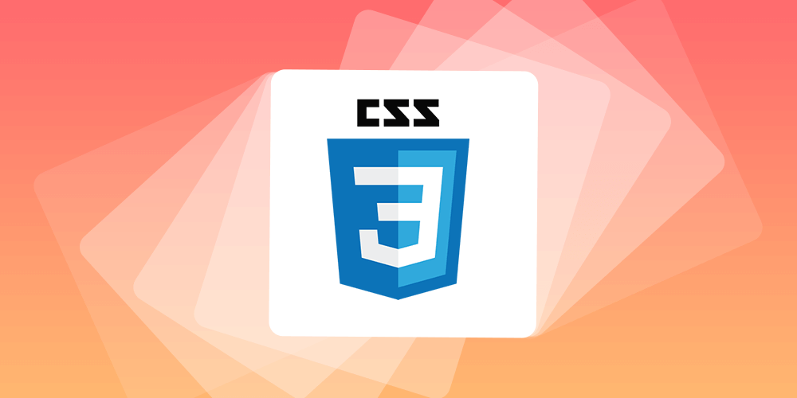

# Read: 14a - CSS Transforms, Transitions, and Animations

*Today we will took a brief about some* `CSS Transforms` `Transitions` `Animations`

> Transforms

 

*With CSS3 came new ways to position and alter elements. Now general layout techniques can be revisited with alternative ways to size, position, and change elements. All of these new techniques are made possible by the transform property.*

*The transform property comes in two different settings, two-dimensional and three-dimensional. Each of these come with their own individual properties and values.*

* Transform Syntax

The actual syntax for the transform property is quite simple, including the transform property followed by the value. The value specifies the transform type followed by a specific amount inside parentheses.

* 2D Transforms

*Elements may be distorted, or transformed, on both a two-dimensional plane or a three-dimensional plane. Two-dimensional transforms work on the x and y axes, known as horizontal and vertical axes. Three-dimensional transforms work on both the x and y axes, as well as the z axis. These three-dimensional transforms help define not only the length and width of an element, but also the depth. We’ll start by discussing how to transform elements on a two-dimensional plane, and then work our way into three-dimensional transforms.*

* 2D Rotate

*The transform property accepts a handful of different values. The rotate value provides the ability to rotate an element from 0 to 360 degrees. Using a positive value will rotate an element clockwise, and using a negative value will rotate the element counterclockwise. The default point of rotation is the center of the element, 50% 50%, both horizontally and vertically. Later we will discuss how you can change this default point of rotation.*

* 2D Scale

*Using the scale value within the transform property allows you to change the appeared size of an element. The default scale value is 1, therefore any value between .99 and .01 makes an element appear smaller while any value greater than or equal to 1.01 makes an element appear larger.*

* 3D Transforms

*Working with two-dimensional transforms we are able to alter elements on the horizontal and vertical axes, however there is another axis along which we can transform elements. Using three-dimensional transforms we can change elements on the z axis, giving us control of depth as well as length and width.*

*3D Rotate

*So far we’ve discussed how to rotate an object either clockwise or counterclockwise on a flat plane. With three-dimensional transforms we can rotate an element around any axes. To do so, we use three new transform values, including rotateX, rotateY, and rotateZ.*

*Using the rotateX value allows you to rotate an element around the x axis, as if it were being bent in half horizontally. Using the rotateY value allows you to rotate an element around the y axis, as if it were being bent in half vertically. Lastly, using the rotateZ value allows an element to be rotated around the z axis.*

*As with the general rotate value before, positive values will rotate the element around its dedicated axis clockwise, while negative values will rotate the element counterclockwise.*

* 3D Scale

*By using the scaleZ three-dimensional transform elements may be scaled on the z axis. This isn’t extremely exciting when no other three-dimensional transforms are in place, as there is nothing in particular to scale. In the demonstration below the elements are being scaled up and down on the z axis, however the rotateX value is added in order to see the behavior of the scaleZ value. When removing the rotateX in this case, the elements will appear to be unchanged.*

> Transitions

 

*As mentioned, for a transition to take place, an element must have a change in state, and different styles must be identified for each state. The easiest way for determining styles for different states is by using the* `:hover` `:focus` `:active` `:target` *pseudo-classes.*

*There are four transition related properties in total, including transition-property, transition-duration, transition-timing-function, and transition-delay. Not all of these are required to build a transition, with the first three are the most popular.*


> Animations

 

*One evolution with CSS3 was the ability to write behaviors for transitions and animations. Front end developers have been asking for the ability to design these interactions within HTML and CSS, without the use of JavaScript or Flash, for years. Now their wish has come true.*

*Transitions do a great job of building out visual interactions from one state to another, and are perfect for these kinds of single state changes. However, when more control is required, transitions need to have multiple states. In return, this is where animations pick up where transitions leave off.*


**For Example**

```
<!DOCTYPE html>
<html>
<head>
<style> 
div {
  width: 100px;
  height: 100px;
  background-color: red;
  animation-name: example;
  animation-duration: 4s;
}

@keyframes example {
  from {background-color: red;}
  to {background-color: yellow;}
}
</style>
</head>
<body>

<p><b>Note:</b> This example does not work in Internet Explorer 9 and earlier versions.</p>

<div></div>

<p><b>Note:</b> When an animation is finished, it changes back to its original style.</p>

</body>
</html>

```


## Contact Info : 
**Please Feel Free To Contact Me When You Need help ^_^**
* [www.facebook.com/aghyadalbalkhi](www.facebook.com/aghyadalbalkhi)
* Email : aghyadalbalkhi@gmail.com


