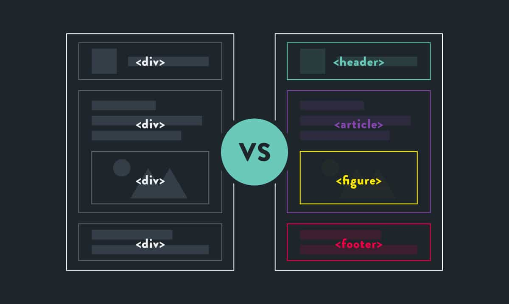
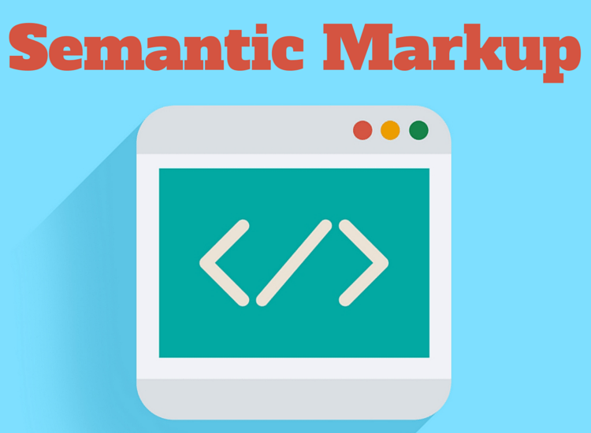
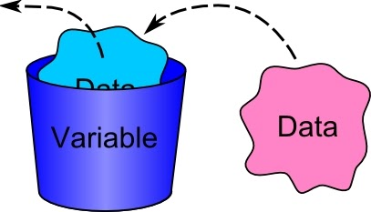
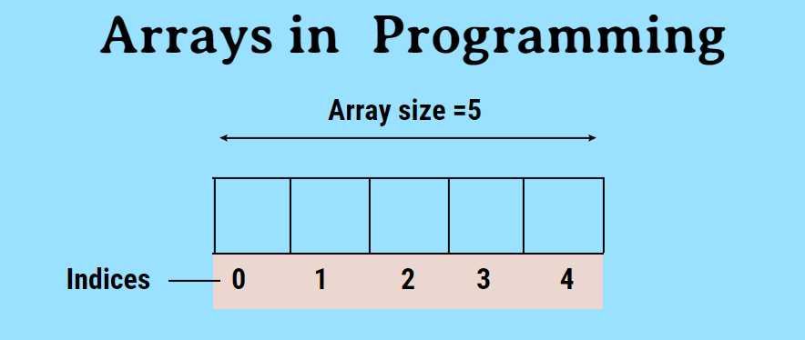
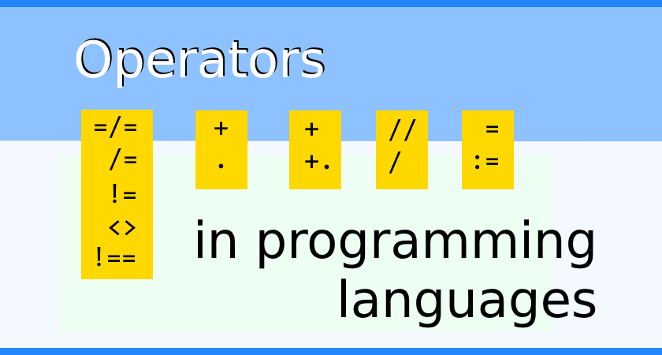
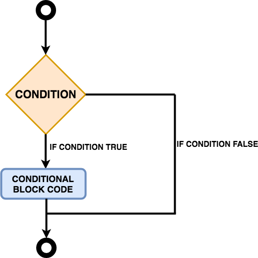
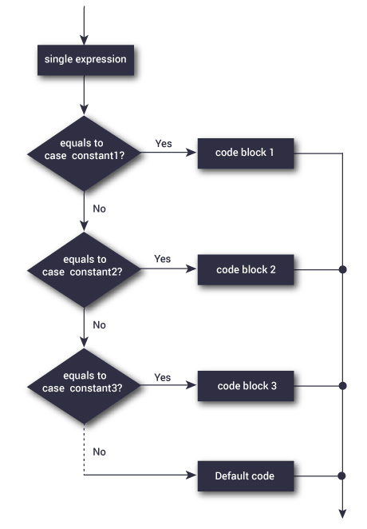

# Readings : Basics of HTML, CSS & JS

**as we learned before about HTML and its Structure which made by elements called** ` Tags`
**Now We Will Learn More about** *Tags* **That are used With Texts**

### For Example 
* Headings and paragraphs
* Bold, italic, emphasis
* Structural and semantic markup

## Let's Start

> Text

 We will learn about: `Structural markup` and `Semantic markup`
 
 - Structural markup

> Normal Elements that Used for descripe Content like `H1` or `P`

 
 - Semantic markup
 
>  That Is a special Tags Made For Browsers and Search engine so by using these tags, The Browsers and Search engine can getting the accurate information for users

 

## Structural markup

**Headings and paragraphs** `Structural markup`
- Heading `<h1>`  `<h1> Readings : Basics of HTML, CSS & JS </h1>`
- Paragraphs `<p>` `<p> We Will Learn More Toghather </p>`
- Bold `<b>` `<b>` `<p> Text In the Bold is More Imprtant </b>`
- Subscript `<sup>` ` <p>2020 Version<sup>2</sup>`


## Semantic markup


**Structural and semantic markup** `Semantic Markup`
- strong `<strong>`
- em `<em>`
- Quotations `<blockquote>`

```

<blockquote cite="https://www.tutorialrepublic.com/css-tutorial/">
 <p>CSS is the key presentational technology that is used in website design</p>
</blockquote>

```

- shorter quotes `<q>` 

```
<p>As Ms Hanna said, <q>also has a great mobile app
</q></p>
 ```

 - address `<address>`

 ```
 <address>
<p><a href="mailto:aghyadalbalkhi@gmail.com">
 aghyadalbalkhi@gmail.com</a></p>
<p>Jordan - AMMAN.</p>
</address>

 ```

 

## CSS

 

> Introduction To CSS
*CSS stands for Cascading Style Sheets and it's responsible of the page Style*
*And the beautiful designs that we see on the web pages it's* `CSS` *Work*

> How CSS Work
*CSS interacts with HTML elements directly and applies the style to them*

**For Example**

*If I have this paragraph*

`<p>Welcome To 201 Course!</p>`

*and I wanna To make some Style, like color or font effects*

```

p  {  color:pink;  font-weight:bold;  }

```

**Some CSS**

- background-color `body { background-color: rgb(200,200,200);}`
- color `h1 {color: DarkCyan;}`
- opacity `p { background-color: rgb(0,0,0);opacity: 0.5;}`


## JavaScript

> Basic JavaScript Instructions

**STATEMENTS**

*A script is a series of instructions that a computer can follow one-by-one*

**COMMENTS**

*It's Used To Expline the Code Writted By Developer*

`var UserName = promot("enter Your Name");   /// It Take the Name Of User`

**VARIABLE**

It's where value stored In

 

`var UserName = promot("enter Your Name");   /// It Take the Name Of User`

*In a above Example the Variable is UserName which store the name that User Inset in Pormot Window*

**ARRAY**

*An array is a data structure where we can store more than one value*

 

```
var Car;
Car ['BMW', 'Audi', ' Toyota']; 

```


**VALUES IN ARRAYS**

*Values In Array Access By Index* 

```

INDEX    VALUE
0       'BMW '
1       'Audi'
2       'Toyota'

```

**OPERATORS**

*they allow programmers to create a single value from one or more values*

 


* ASSIGNMENT OPERATORS *It assign Value To Variable*  ` Car = 'BMW';`
* COMPARISON OPERATORS  *It Compare Values* ` Max = 10 > 2`
* ARITHMETIC OPERATORS  *Doing Math Math*  ` result= 3 * 2;`
* LOGICAL OPERATORS *Combine expressions*  ` result= (3 > 1) && (2 < 14);`
* STRING OPERATORS *Concatention  expressions*  ` GoodMorning= 'Good'+ 'Morning'; `

**Decisions Making and Loops**

**If Statment**

*if statement is conditional statement that, if it true, then performs it run the block code.  if , not its skip it.*
*In Loops, it always checks the condition statement as an entry or stoping loops*

 


**Example**

```
if (hour < 18) {
  greeting = "Good day";
}

```

**Switch Loop**

*a switch statement is a type of condition control  used to allow the value of a variable to change the control of program*

 

**Example**

```

var day;
switch (new Date().getDay()) {
  case 0:
    day = "Sunday";
    break;
  case 1:
    day = "Monday";
    break;
  case 2:
    day = "Tuesday";
    break;
  case 3:
    day = "Wednesday";
    break;
  case 4:
    day = "Thursday";
    break;
  case 5:
    day = "Friday";
    break;
  case  6:
    day = "Saturday";
}
document.getElementById("demo").innerHTML = "Today is " + day;
</script>

```

Example From : [w3schools](https://www.w3schools.com/js/tryit.asp?filename=tryjs_switch)


## Contact Info : 
**Please Feel Free To Contact Me When You Need help ^_^**
* [www.facebook.com/aghyadalbalkhi](www.facebook.com/aghyadalbalkhi)
* Email : aghyadalbalkhi@gmail.com

